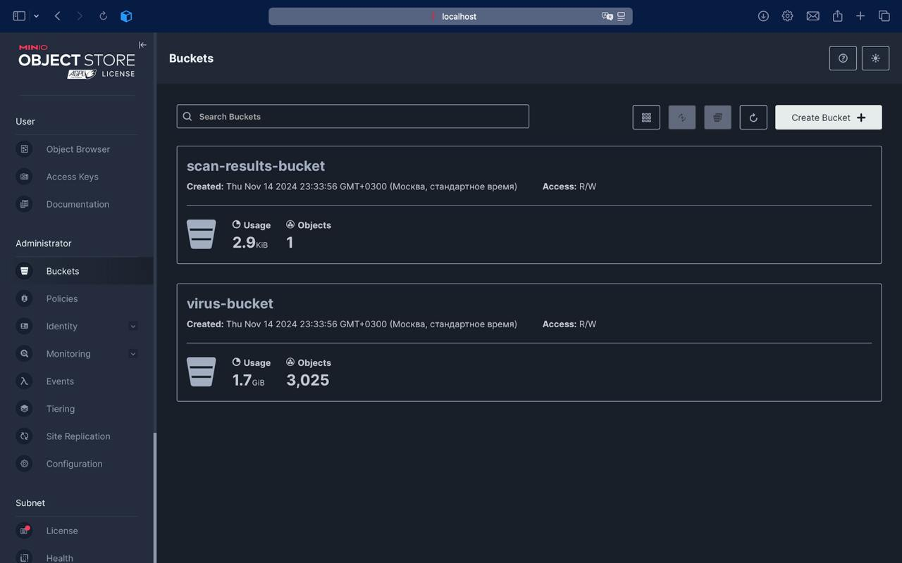

# Файловый процессинг

Утилита на Python, которая:
1.	скачивает файлы с сервиса [VX Underground](https://vx-underground.org/Samples/VirusSign%20Collection/2024.11) за указанный день, день передается в качестве параметра;
2.	извлеченные из загруженного архива файлы сохраняет в S3 хранилище, для локального тестирования необходимо использовать [MinIO](https://hub.docker.com/r/minio/minio) или [Seaweedfs(S3)](https://github.com/seaweedfs/seaweedfs), запущенный в docker-контейнере;
3.	извлеченный файл просканировать набором [YARA-правил](https://github.com/kevoreilly/CAPEv2/tree/master/data/yara/CAPE), результат сканирования сохранить в виде json в S3-хранилище.

Скрипт реализован в виде [Airflow DAG](https://airflow.apache.org/docs/apache-airflow/stable/core-concepts/dags.html) для ежедневного запуска и обработки данных.

Решение оформлено в виде проекта с использованием pyproject.toml

## Запуск проекта
1. Склонировать репозиторий
2. Перейти в корневую папку проекта
3. Если Poetry не установлен, сначала его нужно установить:
    ```commandline
    pip install poetry
    ```
4. Установить все зависимости:
    ```commandline
    poetry install
    ```
5. Запустить проект
    ```commandline
    poetry run python src/main.py DAY_OF_MONTH
    ```
Так же в проекте приложен файл `requirements.txt` для альтернативной установки зависимостей
```commandline
pip install -r requirements.txt
```
В таком случае запуск следующий:
```commandline
python src/main.py DAY_OF_MONTH
```

## Установка и запуск MinIO в Docker
### Скачивание образа
```bash
docker pull minio/minio
```
### Запуск
```bash
mkdir -p ~/minio/data

docker run \
   -p 9000:9000 \
   -p 9001:9001 \
   --name minio \
   -v ~/minio/data:/data \
   -e "MINIO_ROOT_USER=USERNAME" \
   -e "MINIO_ROOT_PASSWORD=PASSWORD" \
   quay.io/minio/minio server /data --console-address ":9001"
```
`mkdir` создает новый локальный каталог в `~/minio/data` в вашем домашнем каталоге.\
`docker run` запускает контейнер MinIO.\
`-p` связывает локальный порт с портом контейнера.\
`-name` создает имя для контейнера.\
`-v` устанавливает путь к файлу в качестве постоянного расположения тома для использования контейнером. Когда MinIO записывает данные в `/data`, эти данные отражаются в локальном пути `~/minio/data`, что позволяет им сохраняться между перезапусками контейнера. Вы можете заменить `~/minio/data` другим локальным расположением файла, к которому у пользователя есть доступ на чтение, запись и удаление.\
`-e` устанавливает переменные среды `MINIO_ROOT_USER` и `MINIO_ROOT_PASSWORD` соответственно. Они устанавливают учетные данные пользователя `root`. Измените значения примера для использования в вашем контейнере.


**API:   http://127.0.0.1:9000**\
**WebUI: http://127.0.0.1:9001**

## Описание функционала утилиты

Данная утилита:
- Скачивает архив зв определённый день (передаваемый в параметре DAY_OF_MONTH) с сайта [VX Underground](https://vx-underground.org/Samples/VirusSign%20Collection/2024.11) в директорию `./downloads`
_(если этой директории не существует, то она создаётся в корне проекта)_
- Распаковывает этот архив в директорию `./extracted_files`
_(если этой директории не существует, то она создаётся в корне проекта)_
- Сканирует извлечённые файлы набором [YARA-правил](https://github.com/kevoreilly/CAPEv2/tree/master/data/yara/CAPE) (они находятся в директории `YARA_rules`)
- Результат записывает в формате `json` в файл `scan_results.json` в директорию `./scan_results`
_(если этой директории не существует, то она создаётся в корне проекта)_
- После этого всё загружается в S3 хранилище в разные bucket:\
      
  - `virus-bucket` - Для распакованного архива\
    
  - `scan-results-bucket` - Для результатов сканирования\
    
  _Если какого-то из bucket не существует, то он создаётся._
- После загрузки в S3 хранилище данные удаляются из локального хранилища
Удаляются директории `./downloads`, `./extracted_files` и `./scan_results`

Логи утилиты\


Так же добавлена схема `.env` файла `.env.example` 
